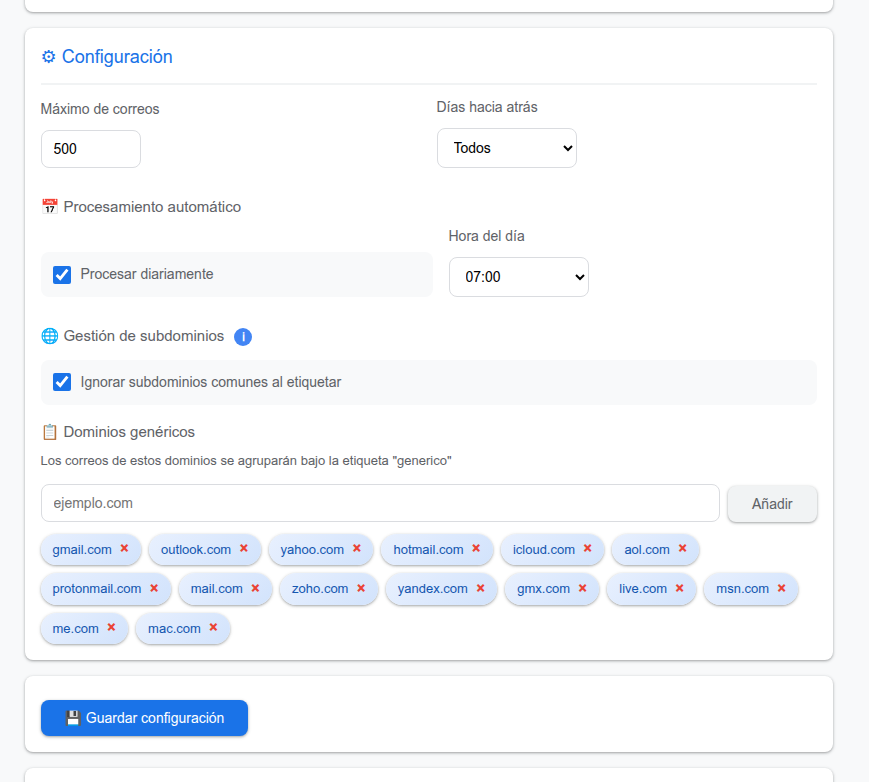
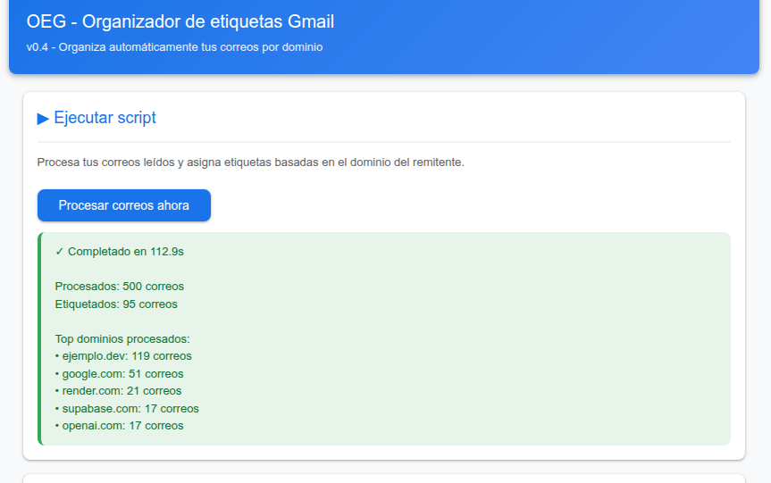
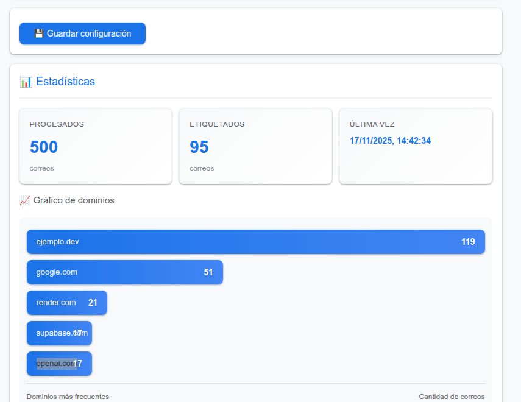

# OEG - Organizador de etiquetas para Gmail (v0.4)

<div align="center">
  
  
  
  
  
</div>

**OEG** es un potente script de Google Apps Script diseñado para organizar automáticamente tu bandeja de entrada de Gmail mediante la creación y asignación de etiquetas basadas en el dominio del remitente. Simplifica la gestión de correos, mejora la visibilidad y te permite tener un control total sobre cómo se clasifican tus mensajes.



## Índice

- [Descripción](#descripción)
- [Características principales](#características-principales)
- [Novedades en v0.4](#novedades-en-v04)
- [Instalación](#instalación)
- [Uso](#uso)
- [Configuración detallada](#configuración-detallada)
- [Estadísticas y visualización](#estadísticas-y-visualización)
- [Arquitectura técnica](#arquitectura-técnica)
- [Permisos requeridos](#permisos-requeridos)
- [Limitaciones](#limitaciones)
- [Solución de problemas](#solución-de-problemas)
- [Migración desde v0.3](#migración-desde-v03)
- [Cómo contribuir](#cómo-contribuir)

## Descripción

Este script analiza los correos electrónicos leídos en tu bandeja de entrada, extrae el dominio del remitente y crea una etiqueta con el nombre de ese dominio (por ejemplo, `github`, `amazon`, `google`). Además, agrupa los correos de proveedores de correo comunes (como `gmail.com`, `outlook.com`) bajo una única etiqueta `generico` para mantener tu lista de etiquetas limpia y organizada.

La característica más avanzada es su capacidad para **ignorar subdominios específicos** (como `e.`, `info.`, `news.`), permitiendo agrupar correos de `info@e.atlassian.com` y `Jira@atlassian.com` bajo la misma etiqueta `atlassian`.

## Características principales

- **Organización automática**: Procesa correos leídos y les asigna etiquetas basadas en el dominio del remitente.
- **Creación de etiquetas inteligente**: Genera nuevas etiquetas si no existen.
- **Agrupación de dominios genéricos**: Mantiene tu espacio de trabajo limpio agrupando correos de dominios como `gmail.com` o `yahoo.com` en una sola etiqueta: `generico`.
- **Control de subdominios**: Permite ignorar subdominios personalizables (ej. `e`, `mail`, `info`) para una clasificación más precisa.
- **Procesamiento programado**: Configura el script para que se ejecute automáticamente cada día a la hora que elijas.
- **Panel de control interactivo**: Una interfaz de usuario intuitiva integrada en Gmail para configurar y ejecutar el script.
- **Panel de estadísticas**: Visualiza datos sobre los correos procesados, las etiquetas creadas y los dominios más frecuentes a través de gráficos y contadores.
- **Exportación de datos**: Exporta las estadísticas de dominios a un archivo CSV compatible con Google Sheets.

## Novedades en v0.4

### Mejoras de rendimiento
- Arquitectura modular: Código reorganizado en módulos especializados para mejor mantenimiento
- Caché de etiquetas: Reduce llamadas redundantes a la API de Gmail
- Procesamiento por lotes: Aplica múltiples etiquetas de forma más eficiente
- Control de tiempo: Previene timeouts en cuentas con mucho correo

### Nuevas características
- Subdominios personalizables: Define qué subdominios ignorar (por defecto: `e`, `mail`, `info`, `news`, `noreply`, etc.)
- Vista previa de procesamiento: Previsualiza qué correos se procesarían sin ejecutar
- Soporte para no leídos: Opción de procesar correos no leídos
- Sistema de logging: Registro estructurado con niveles (DEBUG, INFO, WARN, ERROR, CRITICAL)
- Validación mejorada: Validación robusta de dominios y configuración

### Mejoras técnicas
- Validación de entrada: Todos los campos se validan antes de guardar
- Sanitización automática: Nombres de etiquetas se limpian automáticamente
- Estadísticas ampliadas: Contador de errores, fecha de primera ejecución
- Exportación mejorada: CSV con más información y permisos configurables
- Mejor feedback: Mensajes más descriptivos y tiempo de ejecución mostrado

### Correcciones
- Corregido error de tipeo en `Sidebar.html` (línea 131)
- Mejor manejo de errores en todas las operaciones
- Logging consistente usando `Logger.log`

## Instalación

Para instalar OEG v0.4, sigue estos pasos:

1.  **Accede a Google Apps Script**: Ve a [script.google.com](https://script.google.com/) y haz clic en **Nuevo proyecto**.

2.  **Crea los archivos .gs**:
    -   En el editor, crea los siguientes archivos de script (haz clic en `+` > **Secuencia de comandos**):
        -   `Code.gs` - Punto de entrada principal
        -   `Config.gs` - Gestión de configuración
        -   `LabelManager.gs` - Gestión de etiquetas
        -   `EmailProcessor.gs` - Procesamiento de correos
        -   `Statistics.gs` - Gestión de estadísticas
        -   `Logger.gs` - Sistema de logging
    -   Copia el contenido de cada archivo desde este repositorio.

3.  **Crea los archivos HTML**:
    -   En el editor, haz clic en `+` > **HTML** para crear los siguientes archivos:
        -   `Sidebar.html` - Interfaz de usuario
        -   `Script.html` - Código JavaScript del cliente
        -   `Styles.html` - Estilos CSS
    -   Copia el contenido de los archivos correspondientes de este repositorio.

4.  **Guarda el Proyecto**: Haz clic en el icono de guardar 💾 y dale un nombre descriptivo, como "OEG - Organizador Gmail v0.4".

5.  **Ejecuta la Inicialización**:
    -   Selecciona la función `onOpen` en el menú desplegable de funciones.
    -   Haz clic en **Ejecutar**.
    -   Se te pedirá que autorices los permisos necesarios. Revisa y acepta para continuar.

Una vez completado, el script estará activo en tu cuenta.

## Uso

1.  **Abre Gmail**: Ve a [gmail.com](https://gmail.com).
2.  **Accede al Panel de Control**:
    -   Busca el nuevo menú **OEG** en la barra de menú superior de Gmail.
    -   Haz clic en `OEG` > `Abrir panel de control`.
3.  **Utiliza la Interfaz**:
    -   El panel de control aparecerá en la barra lateral derecha.
    -   Desde aquí, puedes ejecutar el script manualmente, ajustar la configuración y ver las estadísticas.



## Configuración detallada

### Opciones de procesamiento
-   **Máximo de correos a procesar**: Define el número de hilos de correo que se analizarán en cada ejecución (rango: 10-500).
-   **Días hacia atrás**: Limita el análisis a un período de tiempo específico (1, 3, 7, 15, 30 días) o selecciona `Todos` para un análisis completo.

### Procesamiento automático
-   **Activar/Desactivar**: Marca la casilla para que el script se ejecute automáticamente todos los días.
-   **Hora de ejecución**: Selecciona la hora del día (formato 24h) para el procesamiento automático.

### Gestión de dominios
-   **Evitar subdominios**: Activa esta opción para que el script ignore los subdominios definidos en la lista (ej. `support@github.com` se convierte en etiqueta `github`).
    -   El script incluye **42 subdominios comunes** predefinidos
    -   Haz clic en el icono ℹ️ junto al título para ver la lista completa
-   **Dominios genéricos**: Administra la lista de dominios que se agruparán bajo la etiqueta `generico`.

#### Subdominios ignorados por defecto (42)

El script viene con una lista completa de subdominios comunes que se ignoran automáticamente:

**Notificaciones y correos automáticos:**
`e`, `mail`, `email`, `noreply`, `no-reply`, `donotreply`, `notify`, `notifications`, `alerts`, `updates`, `newsletter`

**Marketing y promociones:**
`marketing`, `promo`, `promos`, `offers`, `deals`, `news`

**Soporte y servicio:**
`support`, `help`, `service`, `customerservice`, `contact`

**Técnicos:**
`www`, `webmail`, `smtp`, `imap`, `pop`, `mx`, `mx1`, `mx2`, `bounce`, `mailer`, `sender`

**Sistema:**
`system`, `automated`, `auto`, `admin`, `team`

**Cuentas:**
`accounts`, `account`, `billing`, `invoice`, `receipts`

**Bienvenida:**
`hello`, `hi`, `welcome`, `info`

#### Cómo añadir subdominios personalizados

Si necesitas añadir tus propios subdominios a la lista:

1. **Edita localmente con clasp** (recomendado):
   ```bash
   # Edita el archivo Config.gs líneas 47-56
   # Añade tus subdominios al array ignoredSubdomains
   clasp push --force
   ```

2. **Edita directamente en Apps Script**:
   - Abre tu proyecto en [script.google.com](https://script.google.com)
   - Abre el archivo `Config.gs`
   - Busca el array `ignoredSubdomains` (línea 47)
   - Añade tus subdominios entre comillas y separados por comas
   - Ejemplo: `'custom', 'mysubdomain', 'test'`
   - Guarda el proyecto

**Ejemplo de personalización:**
```javascript
ignoredSubdomains: [
  'e', 'mail', 'info', // ... subdominios por defecto
  'custom', 'mycompany', 'internal' // tus subdominios personalizados
]
```

## Estadísticas y visualización

El panel de estadísticas ofrece una visión clara del trabajo que OEG está haciendo por ti.

-   **Contadores**: `Total procesados`, `Total etiquetados` y `Última ejecución`.
-   **Gráfico de dominios**: Un gráfico de barras que muestra los 5 dominios más frecuentes.
-   **Top dominios**: Una lista detallada de los dominios con más correos.
-   **Acciones**:
    -   **Abrir en Spreadsheet**: Exporta los datos de dominios a un archivo CSV en tu Google Drive.
    -   **Limpiar**: Reinicia todas las estadísticas a cero.



## Arquitectura técnica

### Filosofía de diseño

El código de la v0.4 ha sido completamente refactorizado siguiendo los principios de **Separación de Responsabilidades** (Separation of Concerns) y **Modularidad**. La arquitectura aplicada se basa en:

#### Principios aplicados

1. **Patrón Singleton**: Utilizado en `ConfigManager`, `LabelManager` y `AppLogger` para garantizar una única instancia global y evitar conflictos de estado.

2. **Capa de abstracción**: Cada módulo expone funciones públicas que mantienen compatibilidad con la versión anterior, mientras que la implementación interna usa clases orientadas a objetos.

3. **Caché y optimización**: Implementación de caché en `LabelManager` para reducir llamadas a la API de Gmail, siguiendo el principio de minimizar operaciones costosas.

4. **Validación en capas**: Validación tanto en el cliente (JavaScript) como en el servidor (Apps Script) para garantizar integridad de datos.

5. **Logging estructurado**: Sistema de logging con niveles para facilitar debugging y monitoreo sin afectar rendimiento.

### Módulos backend (.gs)

-   **`Code.gs`**: Punto de entrada principal y funciones de interfaz de usuario (menús, sidebar)
-   **`Config.gs`**: Gestión centralizada de configuración con validación y migración de esquemas
    -   Clase `ConfigManager` con patrón singleton
    -   Validación robusta de parámetros
    -   Sistema de versiones para futuras migraciones
-   **`LabelManager.gs`**: Gestión de etiquetas de Gmail
    -   Caché de etiquetas para optimización
    -   Extracción y validación de dominios
    -   Sanitización de nombres de etiquetas
    -   Procesamiento por lotes
-   **`EmailProcessor.gs`**: Procesamiento de correos electrónicos
    -   Control de tiempo de ejecución
    -   Construcción optimizada de queries
    -   Vista previa de procesamiento
    -   Soporte para correos no leídos
-   **`Statistics.gs`**: Gestión de estadísticas
    -   Obtención, actualización y limpieza de datos
    -   Exportación a CSV con permisos configurables
    -   Resúmenes estadísticos
-   **`Logger.gs`**: Sistema de logging estructurado
    -   Niveles: DEBUG, INFO, WARN, ERROR, CRITICAL
    -   Persistencia opcional
    -   Exportación de logs

### Módulos frontend (.html)

-   **`Sidebar.html`**: Estructura HTML de la interfaz de usuario
-   **`Script.html`**: Código JavaScript del cliente (lógica de interacción)
-   **`Styles.html`**: Estilos CSS para la interfaz

### Almacenamiento

El script utiliza `PropertiesService` de Google Apps Script para almacenar:
-   Configuración del usuario
-   Estadísticas de procesamiento
-   Logs del sistema (opcional)

## Permisos requeridos

Para funcionar correctamente, el script necesita los siguientes permisos de tu cuenta de Google:
-   **Leer y modificar tu correo de Gmail**: Para analizar los mensajes y aplicar etiquetas.
-   **Ejecutar como tú**: Para que los triggers automáticos funcionen.
-   **Mostrar una interfaz de usuario personalizada**: Para renderizar el panel de control en Gmail.
-   **Crear y gestionar archivos en Google Drive**: Para la funcionalidad de exportación a CSV.

## Limitaciones

-   El script solo procesa correos que ya han sido **leídos**.
-   Está sujeto a las [cuotas y limitaciones de Google Apps Script](https://developers.google.com/apps-script/guides/services/quotas). Un uso intensivo en cuentas con un volumen de correo muy alto podría alcanzar estos límites.
-   El procesamiento inicial en una bandeja de entrada muy grande puede tardar varios minutos.

## Solución de problemas

-   **El menú "OEG" no aparece en Gmail**: Refresca la página de Gmail. Si persiste, asegúrate de haber ejecutado la función `onOpen` correctamente durante la instalación.
-   **El script falla durante la ejecución**: Revisa los registros de ejecución en el editor de Google Apps Script (`Ver` > `Ejecuciones`) para identificar el error. Usa la función `getAppLogs()` para ver logs detallados.
-   **Problemas de permisos**: Si encuentras errores de autorización, intenta ejecutar de nuevo la función `onOpen` para volver a lanzar el diálogo de permisos.
-   **Error de validación al guardar configuración**: Verifica que todos los valores estén dentro de los rangos permitidos (maxEmails: 10-500, processHour: 0-23, daysBack: -1 a 365).
-   **El procesamiento se detiene antes de terminar**: Esto es normal en cuentas con mucho correo. El script se detiene antes del timeout. Ejecuta nuevamente para continuar procesando.
-   **Dominios no válidos**: Asegúrate de que los dominios tengan el formato correcto (ej: `example.com`, no `www.example.com` ni `https://example.com`).

## Migración desde v0.3

Si ya tienes instalada la versión 0.3, sigue estos pasos para actualizar:

1.  **Crea los nuevos archivos**: Añade `Config.gs`, `LabelManager.gs`, `EmailProcessor.gs` y `Logger.gs` a tu proyecto.

2.  **Actualiza los archivos existentes**:
    -   Reemplaza el contenido de `Code.gs`, `Statistics.gs`, `Sidebar.html` y `Script.html` con las versiones nuevas.

3.  **Migración automática**:
    -   La configuración existente se migrará automáticamente al nuevo formato.
    -   Las estadísticas se preservan y se complementan con nuevos campos.
    -   Los triggers automáticos se recrean si estaban activos.

4.  **Verifica la instalación**:
    -   Ejecuta la función `onOpen` para inicializar.
    -   Abre el panel de control en Gmail y verifica que todo funcione.

### Notas importantes
-   Compatible con v0.3: No se pierde configuración ni estadísticas
-   Sin cambios en la UI: La interfaz de usuario es la misma
-   Nuevas funciones disponibles: Validación mejorada, logging, etc.

## Cómo contribuir

Las contribuciones son bienvenidas. Si tienes ideas para nuevas funcionalidades, mejoras o has encontrado un error, por favor, abre un *issue* o envía un *pull request*.

### Áreas de mejora sugeridas
-   Tests unitarios para funciones críticas
-   Modo simulación (previsualizar sin ejecutar)
-   Reglas personalizadas de etiquetado
-   Dashboard avanzado con gráficos temporales
-   Integración en tiempo real con Google Sheets

---

**Versión**: 0.4
**Fecha de actualización**: 2025-11-17
**Autor**: 686f6c61 - [@hex686f6c61](https://x.com/hex686f6c61)