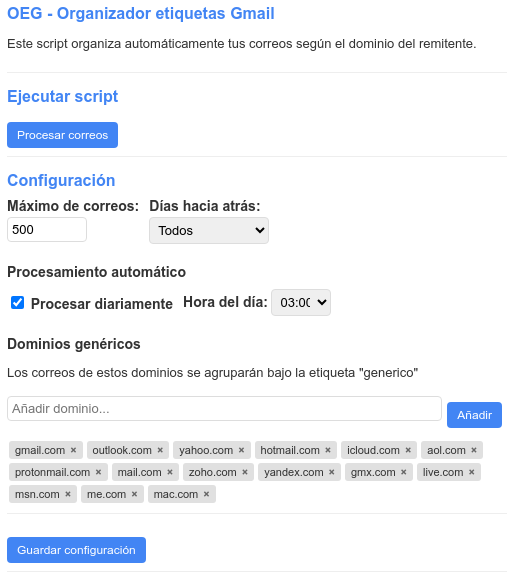
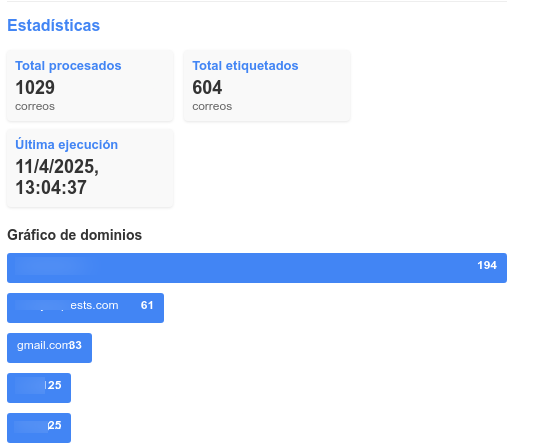

# OEG - Organizador etiquetas Gmail (V.0.2)

  
  
  
  
  

## Descripción
Este script de Google Apps Script organiza automáticamente los correos de Gmail según el dominio del remitente. Crea etiquetas basadas en el nombre del dominio y agrupa los correos de dominios genéricos (como gmail.com, outlook.com, etc.) bajo una etiqueta común.

## Características

### Funcionalidades principales
- Procesamiento automático de correos leídos
- Creación automática de etiquetas basadas en dominios
- Agrupación de dominios genéricos bajo una etiqueta común "generico"
- Interfaz de usuario moderna y compacta
- Control de cuántos correos procesar (configurable)

### Características avanzadas
- **Procesamiento automático diario**: Programa la ejecución automática a una hora específica cada día
- **Opción "Todos" para días hacia atrás**: Permite procesar todos los correos sin limitación de fecha
- **Visualización de estadísticas**: Muestra contadores de correos procesados y etiquetados
- **Gráfico de dominios**: Visualización gráfica de los dominios más frecuentes
- **Exportación de estadísticas**: Permite exportar los datos a CSV
- **Gestión de dominios genéricos**: Interfaz para añadir o eliminar dominios de la lista

### Dominios genéricos preconfigurados
El script viene con una lista predefinida de dominios genéricos que se agruparán bajo la etiqueta "generico":
- gmail.com, outlook.com, yahoo.com, hotmail.com, icloud.com
- protonmail.com, mail.com, zoho.com, yandex.com
- gmx.com, live.com, msn.com, me.com, mac.com, aol.com

## Instalación

### Método 1: Crear un nuevo proyecto
1. Accede a [Google Apps Script](https://script.google.com/)
2. Crea un nuevo proyecto
3. Copia y pega el contenido de los archivos `Code.gs` y `Sidebar.html` en tu proyecto
4. Guarda el proyecto con el nombre "OEG - Organizador etiquetas Gmail"
5. Ejecuta la función `onOpen` para inicializar el script

### Método 2: Desplegar desde este repositorio
1. Clona este repositorio
2. Utiliza [clasp](https://developers.google.com/apps-script/guides/clasp) para desplegar el script en tu cuenta de Google

## Uso

### Como aplicación web
1. Despliega el script como aplicación web desde el editor de Google Apps Script
2. Accede a la URL generada para abrir la interfaz
3. Configura las opciones y haz clic en "Procesar correos"

### Como complemento de Gmail
1. Una vez instalado, abre Gmail
2. Verás un nuevo menú llamado "OEG" en la barra superior
3. Haz clic en "OEG" > "Abrir panel de control"
4. En el panel lateral podrás:
   - Ejecutar el procesamiento de correos
   - Ver estadísticas de uso
   - Configurar todas las opciones

## Configuración

### Opciones principales
- **Máximo de correos a procesar**: Limita cuántos correos se procesarán en cada ejecución (10-500)
- **Días hacia atrás**: 
  - Define el período de tiempo a revisar (1, 3, 7, 15 o 30 días)
  - Opción "Todos" para procesar sin límite de fecha
- **Procesamiento automático**:
  - Opción para activar el procesamiento diario automático
  - Selector de hora del día para la ejecución (formato 24h)

### Gestión de dominios genéricos
- Añadir nuevos dominios a la lista
- Eliminar dominios existentes
- Visualizar todos los dominios configurados

### Estadísticas
- **Total procesados**: Número total de correos procesados
- **Total etiquetados**: Número de correos que han recibido etiquetas
- **Última ejecución**: Fecha y hora de la última vez que se ejecutó el script
- **Gráfico de dominios**: Visualización de los dominios más frecuentes
- **Exportación**: Posibilidad de exportar estadísticas a CSV

## Permisos
El script requiere los siguientes permisos:
- Leer y modificar tu correo de Gmail
- Ejecutar como tú
- Mostrar una interfaz de usuario personalizada

## Limitaciones
- El script solo procesa correos leídos
- Existe un límite de cuota diaria de Google Apps Script (consulta la [documentación oficial](https://developers.google.com/apps-script/guides/services/quotas))
- El script no procesa correos sin un remitente válido
- La opción "Todos" para días hacia atrás puede consumir más cuota si hay muchos correos

## Arquitectura técnica

### Estructura de archivos
- **Code.gs**: Lógica principal del script y funciones de procesamiento
- **Statistics.gs**: Módulo para gestión de estadísticas
- **Sidebar.html**: Estructura de la interfaz de usuario
- **Styles.html**: Estilos CSS para la interfaz
- **Script.html**: Código JavaScript para la interfaz

### Tecnologías utilizadas
- Google Apps Script
- Gmail API
- HTML/CSS para la interfaz de usuario
- JavaScript para la lógica del cliente
- Almacenamiento de propiedades de usuario para configuración y estadísticas

## Solución de problemas
- Si el menú "OEG" no aparece, actualiza la página o cierra y vuelve a abrir Gmail
- Si el script falla, verifica que tienes los permisos necesarios
- Para problemas persistentes, revisa los registros de ejecución en el editor de Google Apps Script

## Contribuir
Siéntete libre de contribuir a este proyecto mediante pull requests o reportando problemas.
