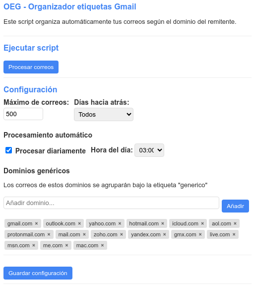

# OEG - Organizador de etiquetas para Gmail (v0.5)

<div align="center">
  
  
  
  
  
</div>

**OEG** es un script de Google Apps Script que organiza automaticamente tu bandeja de entrada de Gmail mediante etiquetas basadas en el dominio del remitente. Extrae el dominio registrable de cada correo (por ejemplo, `amazon` de `newsletter.amazon.com`) y crea o asigna la etiqueta correspondiente.



## Indice

- [Descripcion](#descripcion)
- [Caracteristicas principales](#caracteristicas-principales)
- [Novedades en v0.5](#novedades-en-v05)
- [Instalacion](#instalacion)
- [Uso](#uso)
- [Configuracion detallada](#configuracion-detallada)
- [Estadisticas y visualizacion](#estadisticas-y-visualizacion)
- [Arquitectura tecnica](#arquitectura-tecnica)
- [Permisos requeridos](#permisos-requeridos)
- [Limitaciones](#limitaciones)
- [Solucion de problemas](#solucion-de-problemas)
- [Migracion desde v0.4](#migracion-desde-v04)
- [Como contribuir](#como-contribuir)

## Descripcion

El script analiza los correos de tu bandeja de entrada, extrae el dominio registrable del remitente y crea una etiqueta con ese nombre. Por ejemplo, un correo de `noreply@newsletter.amazon.com` recibe la etiqueta `amazon`. Los correos de proveedores genericos (`gmail.com`, `outlook.com`, etc.) se agrupan bajo la etiqueta `generico`.

La v0.5 mejora sustancialmente la extraccion de dominios: trabaja desde la derecha del nombre de dominio para obtener siempre el dominio de la organizacion, con soporte para TLD de pais como `.co.uk`, `.com.br` o `.gob.es`.

## Caracteristicas principales

- **Organizacion automatica**: procesa correos leidos y asigna etiquetas por dominio del remitente.
- **Extraccion inteligente de dominios**: resuelve subdominios y TLD de pais para obtener el nombre de la organizacion (`shop.example.co.uk` -> `example`).
- **Agrupacion de dominios genericos**: correos de Gmail, Outlook, Yahoo, etc., se agrupan bajo `generico`.
- **Procesamiento programado**: ejecucion automatica diaria a la hora que elijas.
- **Panel de control interactivo**: interfaz Material Design integrada con configuracion, ejecucion y estadisticas.
- **Estadisticas con graficos**: contadores, grafico de barras de los dominios mas frecuentes y exportacion a CSV.
- **Seguridad XSS**: la interfaz usa metodos DOM seguros (`textContent`, `createElement`) en vez de `innerHTML` para todo contenido dinamico.

## Novedades en v0.5

### Correccion de etiquetado de subdominios

El cambio mas importante de esta version. En v0.4, el metodo `getLabelName` tomaba la primera parte del dominio como nombre de etiqueta, lo que producia resultados incorrectos:

| Correo | v0.4 (incorrecto) | v0.5 (correcto) |
|--------|-------------------|-----------------|
| `user@newsletter.amazon.com` | `newsletter` | `amazon` |
| `user@shop.example.co.uk` | `shop` | `example` |
| `user@mail.github.com` | `mail` | `github` |
| `user@noreply.atlassian.com` | `noreply` | `atlassian` |

El nuevo algoritmo extrae el dominio registrable trabajando desde la derecha y detecta segundos niveles de pais (`.co.uk`, `.com.br`, `.gob.es`, etc.) mediante la constante `COUNTRY_SLDS`.

### Correccion de processUnreadEmails

La funcion `processUnreadEmails` tenia un bug que impedia que etiquetara nada: el metodo `_processThreadBatch` incluia un check `if (!firstMessage.isUnread())` que filtraba los correos no leidos que la propia consulta habia buscado. Eliminado.

### Limite de domainStats

`PropertiesService` tiene un tope de 9 KB por propiedad. Con miles de dominios unicos, el JSON de estadisticas podia superar ese limite y fallar silenciosamente. Ahora se recorta a los 500 dominios mas frecuentes.

### Seguridad frontend (XSS)

- `updateDomainTags` usaba `innerHTML` para inyectar dominios directamente, lo que permitia ejecutar scripts arbitrarios. Ahora usa `textContent` y `createElement`.
- `showStatus` reconstruido con metodos DOM seguros (`showStatusSafe`).
- Funcion `escapeHtml()` disponible como capa de defensa adicional.
- Todos los `onclick` inline eliminados del HTML; listeners centralizados en `bindEventListeners()`.

### Mejoras de UI

- **Tooltip de subdominios dinamico**: se genera desde la configuracion cargada, eliminando la duplicacion con `Config.gs`.
- **Selector de hora generado por JS**: las 24 opciones se crean programaticamente.
- **Enter en el campo de dominio**: pulsar Enter anade el dominio sin necesidad de hacer clic.
- **Debounce en botones**: todos los botones de accion se deshabilitan durante la operacion para evitar doble clic.
- **Skeleton de carga**: las tarjetas de estadisticas muestran un efecto de carga animado hasta que llegan los datos.
- **Estados vacios con guia**: los bloques sin datos muestran texto orientativo en vez de un simple "No hay datos".
- **Footer con clase CSS**: sustituye los estilos inline del footer original.
- **Barras del grafico**: ancho minimo de 80px y `text-overflow: ellipsis` para evitar que el texto se solape.
- **Shimmer eliminado**: la animacion infinita de las barras del grafico se ha eliminado.

### Limpieza de codigo

- **Patron Singleton eliminado**: no aporta nada en Google Apps Script, donde cada invocacion crea un nuevo aislamiento V8.
- **`_isValidDomain` unificado**: la funcion duplicada en `ConfigManager` y `LabelManager` se ha extraido a una global `isValidDomain()` en Config.gs.
- **`getLabelStats` eliminado**: llamaba a `label.getThreads()` por cada etiqueta del usuario (problema N+1). Con cientos de etiquetas podia agotar el tiempo de ejecucion. Nunca se usaba desde el frontend.
- **`Logger.gs` simplificado**: la clase `AppLogger` (260 lineas de codigo muerto que nunca se invocaba) se ha sustituido por 3 funciones utiles: `persistLog`, `getAppLogs`, `clearAppLogs`.
- **`saveConfig` devuelve errores**: el wrapper ahora devuelve `{ success, errors }` en vez de un booleano, permitiendo que la UI muestre los errores de validacion concretos.
- **`GmailApp.getUi()` eliminado**: no existe en la API de Gmail standalone; el fallback en `onOpen` se ha simplificado.
- **Fechas con zero-padding**: las queries de busqueda ahora usan `01/05` en vez de `1/5`.

## Instalacion

### Opcion A: con clasp (recomendada)

[clasp](https://github.com/nicedoc/clasp) es la CLI oficial de Google Apps Script. Permite gestionar el proyecto desde la terminal.

```bash
# 1. Instalar clasp si no lo tienes
npm install -g @google/clasp

# 2. Autenticarse con tu cuenta de Google
clasp login

# 3. Clonar este repositorio
git clone https://github.com/686f6c61/organizador-etiquetas-gmail-google-script.git
cd organizador-etiquetas-gmail-google-script

# 4. Crear el proyecto en Google Apps Script
clasp create --title "OEG - Organizador etiquetas Gmail" --type standalone

# 5. Subir los archivos
clasp push --force
```

Despues, abre el editor con la URL que te indica clasp, implementa como aplicacion web y autoriza los permisos.

### Opcion B: manual

1. Ve a [script.google.com](https://script.google.com/) y crea un **Nuevo proyecto**.
2. Crea los archivos `.gs` (`Code.gs`, `Config.gs`, `LabelManager.gs`, `EmailProcessor.gs`, `Statistics.gs`, `Logger.gs`) y copia el contenido desde este repositorio.
3. Crea los archivos `.html` (`Sidebar.html`, `Script.html`, `Styles.html`) y copia el contenido.
4. Guarda el proyecto.
5. Ve a **Implementar > Nueva implementacion > Aplicacion web**, configura "Ejecutar como: yo" y "Acceso: solo yo", e implementa.
6. Autoriza los permisos cuando te los pida.

## Uso

1. Abre la URL de la aplicacion web que te ha dado el despliegue.
2. La interfaz muestra tres secciones: ejecucion, configuracion y estadisticas.
3. Pulsa **Procesar correos ahora** para una ejecucion manual.
4. Activa el procesamiento automatico si quieres que se ejecute diariamente.

Si prefieres usarlo como sidebar en Google Sheets:

1. Abre una hoja de calculo de Google Sheets.
2. En el editor de Apps Script del spreadsheet, copia los archivos del proyecto.
3. Recarga la hoja: aparecera el menu **OEG > Abrir panel de control**.


## Configuracion detallada

### Opciones de procesamiento

- **Maximo de correos**: numero de hilos a analizar por ejecucion (10-500).
- **Dias hacia atras**: periodo de busqueda (1, 3, 7, 15, 30 dias o Todos).

### Procesamiento automatico

- **Procesar diariamente**: activa un trigger que ejecuta el script cada dia.
- **Hora del dia**: hora de ejecucion en formato 24h.

### Gestion de subdominios

- **Extraer dominio principal**: cuando esta activado (por defecto en v0.5), el script extrae el dominio registrable desde la derecha. Esto significa que `newsletter.amazon.com`, `shop.amazon.com` y `noreply.amazon.com` generan todos la etiqueta `amazon`.
- El algoritmo detecta automaticamente TLD de pais compuestos: `shop.example.co.uk` genera `example`, no `shop` ni `co`.
- Con esta opcion desactivada, se usa la primera parte del dominio tal cual (comportamiento legacy de v0.4).

### Dominios genericos

Los correos de estos dominios se agrupan bajo la etiqueta `generico`. La lista por defecto incluye:

`gmail.com`, `outlook.com`, `yahoo.com`, `hotmail.com`, `icloud.com`, `aol.com`, `protonmail.com`, `mail.com`, `zoho.com`, `yandex.com`, `gmx.com`, `live.com`, `msn.com`, `me.com`, `mac.com`

Puedes anadir o quitar dominios desde la interfaz.

### Subdominios ignorados (referencia)

El script incluye 42 subdominios comunes predefinidos. Con la opcion "Extraer dominio principal" activada, estos subdominios ya no son necesarios para el etiquetado (el algoritmo extrae el dominio correcto independientemente), pero se mantienen como referencia y se muestran en el tooltip informativo de la interfaz.

**Notificaciones:** `e`, `mail`, `email`, `noreply`, `no-reply`, `donotreply`, `notify`, `notifications`, `alerts`, `updates`, `newsletter`

**Marketing:** `marketing`, `promo`, `promos`, `offers`, `deals`, `news`

**Soporte:** `support`, `help`, `service`, `customerservice`, `contact`

**Tecnicos:** `www`, `webmail`, `smtp`, `imap`, `pop`, `mx`, `mx1`, `mx2`, `bounce`, `mailer`, `sender`

**Sistema:** `system`, `automated`, `auto`, `admin`, `team`

**Cuentas:** `accounts`, `account`, `billing`, `invoice`, `receipts`

**Bienvenida:** `hello`, `hi`, `welcome`, `info`

## Estadisticas y visualizacion

El panel de estadisticas muestra:

- **Contadores**: total de correos procesados, etiquetados y fecha de ultima ejecucion.
- **Grafico de barras**: los 5 dominios con mas correos.
- **Top dominios**: lista de los 10 dominios mas frecuentes.
- **Exportar CSV**: genera un archivo CSV en Google Drive con todas las estadisticas por dominio.
- **Limpiar estadisticas**: reinicia todos los contadores a cero.

Las estadisticas por dominio se limitan a 500 entradas para no exceder el limite de 9 KB de PropertiesService. Se conservan siempre los dominios mas frecuentes.


## Arquitectura tecnica

### Modulos backend (.gs)

| Archivo | Responsabilidad |
|---------|----------------|
| `Code.gs` | Punto de entrada: `doGet()`, `onOpen()`, `showSidebar()`, `updateTrigger()` |
| `Config.gs` | Gestion de configuracion, validacion, migracion de esquemas, constantes globales (`COUNTRY_SLDS`, `VALIDATION_LIMITS`, `isValidDomain()`) |
| `LabelManager.gs` | Extraccion de dominios, resolucion de etiquetas con soporte de TLD de pais, cache en memoria, aplicacion por lotes |
| `EmailProcessor.gs` | Procesamiento de correos leidos y no leidos, control de timeout (4.5 min), vista previa |
| `Statistics.gs` | Estadisticas acumuladas, recorte de domainStats a 500 entradas, exportacion CSV |
| `Logger.gs` | Funciones de logging persistente para diagnosticar ejecuciones automaticas |

### Modulos frontend (.html)

| Archivo | Responsabilidad |
|---------|----------------|
| `Sidebar.html` | Estructura HTML con placeholders para contenido dinamico |
| `Script.html` | Logica del cliente: carga de datos, validacion, eventos, renderizado seguro (DOM methods) |
| `Styles.html` | Estilos CSS Material Design con variables, animaciones y estados de carga |

### Principios de diseno

- **Validacion en dos capas**: el cliente valida antes de enviar; el servidor valida antes de guardar.
- **Seguridad por defecto**: contenido dinamico via `textContent` y `createElement`; cero `innerHTML` con datos de usuario.
- **Limites defensivos**: recorte de domainStats, timeout de ejecucion, sanitizacion de nombres de etiqueta.
- **Sin estado entre ejecuciones**: cada invocacion de Apps Script crea un nuevo aislamiento V8, por lo que no se usan patrones que asuman persistencia en memoria (singleton, cache global).

### Almacenamiento

El script usa `PropertiesService.getUserProperties()` para guardar:

- Configuracion del usuario (dominios genericos, opciones de procesamiento)
- Estadisticas acumuladas (totales, estadisticas por dominio)
- Logs persistidos (opcional, para diagnosticar triggers)

## Permisos requeridos

| Permiso | Motivo |
|---------|--------|
| `gmail.modify` | Leer mensajes y aplicar etiquetas |
| `gmail.labels` | Crear y gestionar etiquetas |
| `drive.file` | Exportar estadisticas a CSV |
| `script.scriptapp` | Crear triggers para ejecucion automatica |
| `userinfo.email` | Identificar la cuenta del usuario |

## Limitaciones

- Solo procesa correos **leidos** por defecto (existe `processUnreadEmails` para no leidos).
- Sujeto a las [cuotas de Google Apps Script](https://developers.google.com/apps-script/guides/services/quotas): limite de 6 minutos por ejecucion, cuota diaria de llamadas a la API.
- El procesamiento inicial en bandejas muy grandes puede requerir varias ejecuciones; el script se detiene automaticamente antes del timeout y puede reanudarse.
- Las estadisticas por dominio se limitan a 500 entradas por restricciones de almacenamiento.

## Solucion de problemas

| Problema | Solucion |
|----------|---------|
| El menu OEG no aparece en Gmail | OEG funciona como webapp independiente o sidebar en Sheets; en Gmail puro, usa la URL de la implementacion |
| El script falla durante la ejecucion | Revisa los logs en el editor de Apps Script (`Ver > Ejecuciones`) o usa `getAppLogs()` |
| Error de validacion al guardar | Verifica que los valores esten dentro de los rangos: maxEmails (10-500), processHour (0-23), daysBack (-1 a 365) |
| El procesamiento se detiene antes de terminar | Normal en cuentas con mucho correo; el script respeta el limite de 4.5 min. Ejecuta de nuevo para continuar |
| Dominios no validos | Usar formato `example.com`, sin `www.`, `https://` ni barras |
| Subdominios generan etiquetas incorrectas | Asegurate de que "Extraer dominio principal" este activado en la configuracion |

## Migracion desde v0.4

1. **Sustituye todos los archivos** del proyecto con los de la v0.5 (los 6 `.gs` y los 3 `.html`).
2. **Migracion automatica**: al cargar la configuracion, el script detecta la version 1.0 del esquema y migra a 1.1, activando `avoidSubdomains` por defecto.
3. **Sin perdida de datos**: las estadisticas y la configuracion existente se preservan.
4. **Verifica**: abre la interfaz y comprueba que "Extraer dominio principal" este marcado.

### Cambios que rompen compatibilidad

- `saveConfig()` ahora devuelve `{ success: boolean, errors: string[] }` en vez de un booleano. Si tienes codigo personalizado que llama a esta funcion, adapta la lectura del resultado.
- `getLabelStats()` y `getAllLabels()` se han eliminado de `LabelManager.gs`. Si los usabas desde codigo externo, puedes llamar directamente a `GmailApp.getUserLabels()`.

## Como contribuir

Las contribuciones son bienvenidas. Abre un issue o envia un pull request.

### Areas de mejora sugeridas

- Tests unitarios para funciones criticas
- Reglas personalizadas de etiquetado (no solo por dominio)
- Dashboard avanzado con graficos temporales
- Soporte para etiquetas anidadas (ej. `dominios/amazon`)
- Deteccion automatica de TLD de pais sin lista fija

---

**Version**: 0.5
**Fecha de actualizacion**: 2025-02-27
**Autor**: 686f6c61 - [@hex686f6c61](https://x.com/hex686f6c61)
